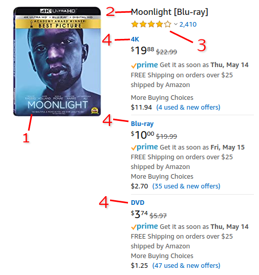
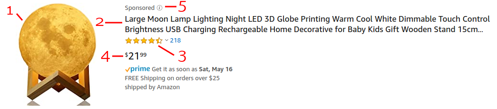

# unofficial-amazon-search
A simple client for searching Amazon

## Install

`npm install unofficial-amazon-search`

## How to use

`searchAmazon` returns `Promise<Array<AmazonSearchResult>>`.

```
import {searchAmazon, AmazonSearchResult} from 'unofficial-amazon-search';
// OR
const {searchAmazon, AmazonSearchResult} = require('unofficial-amazon-search');

searchAmazon('anything you would put in the search bar').then(results => {
  console.log(results);
  console.log(results[0].title, results[0].imageUrl);
});
```

The above works in Node and frontend environments with compiled code.

`unofficial-amazon-search` can also be imported from a `<script>` tag and used in raw JS. Importing it will attach the
module to the `window` object.

```
<!DOCTYPE html>
<html lang="en">
<head>
  <title>My beautiful webpage</title>
  <meta charset="UTF-8">
</head>
<body></body>
<script src="./_bundles/unofficial-amazon-search.js" rel="script"></script>
<script>
  var searchAmazon = window.UnofficialAmazonSearch.searchAmazon;
  searchAmazon('123').then(function (results) {
    console.log(results);
  });
</script>
</html>
```

The bundle contains minified and non-minified bundles of the compiled search code.

## API

### Function `searchAmazon`

Parameters:

- `query` - string that you'd put into the Amazon website search bar
- `includeSponsoredResults` - boolean, optional, will prevent filtering out ads

Returns an array of `AmazonSearchResult`.

### Class `AmazonSearchResult`





1. `imageUrl` - lead product image that shows in search results
2. `title` - name of product  
`productUrl` - URL for product details page
3. `rating` - x out of y possible score (e.x. 4.2 out of 5)
4. `prices` - Search often lists multiple prices for versions of an item. This is a set of all found prices, some of 
which have labels attached (for example, if you search a DVD barcode number, there are multiple prices, for DVD, Blu-ray
and 4K, and each has a label like "4K"). Price label is null if cannot find it on page
5. `sponsored` - whether result is an ad. `searchAmazon` filters out these by default
